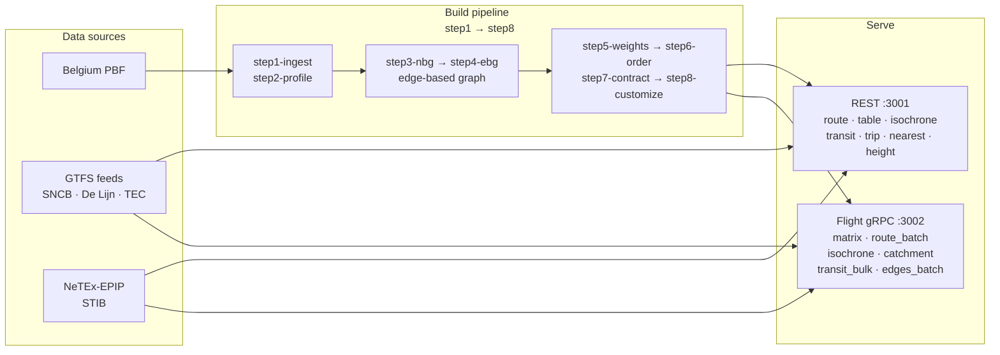

<p align="center">
  
</p>

# Butterfly-OSM

Production-grade routing engine and OSM toolkit, in Rust.

Exact turn-aware edge-based CCH for driving, walking, cycling, and trucking;
a full RAPTOR + ULTRA multimodal transit stack with merged GTFS and
NeTEx-EPIP feeds; REST + Arrow Flight gRPC; Belgium-latest deployed today,
faster than OSRM at scale.

[](LICENSE)

## At a glance

- **Matrix 10k×10k via Flight gRPC**: 32.5 s end-to-end (vs drivetimes/libosrm 614 s — 19× faster on the wire).
- **Flight gRPC matrix 50k×50k**: 9.61 min (parity with the historical `/table/stream` baseline; OSRM cannot run it).
- **`/isochrone` 30-min**: 5 ms p50; bulk endpoint sustains **1 526 iso/sec**.
- **`/route?avoid_polygons=...`**: ~780 ms cold MISS, ~22 ms warm HIT (incremental recustomization + LRU cache, #240).
- **`/transit` single warm**: 35 ms p50; `/transit/bulk` sustains 311 q/s on varied queries.
- **Coverage**: 4 modes (car, bike, foot, truck) × 4 merged transit feeds (SNCB, De Lijn, TEC, STIB).
- Belgium artifact `data/belgium/baseline.butterfly` deployed to the production `belgium-latest` container.

## Quickstart

```bash
docker build -t butterfly-route .
docker run -d --name butterfly -p 3001:8080 -p 3002:8081 \
  -v "${PWD}/data/belgium:/data" butterfly-route
curl "http://localhost:3001/route?src_lon=4.3517&src_lat=50.8503&dst_lon=4.4025&dst_lat=51.2194&mode=car"
```

Boot is ~30-40 s for the road graph alone, ~3 min with transit feeds. See
[Quickstart](docs/quickstart.md) for the full walk-through including the
upstream `butterfly-dl` + step1–step8 pipeline.

## Workspace

```
butterfly-osm/
├── butterfly-common/   # shared error types + utilities
├── dl/                 # butterfly-dl — OSM downloader (<1GB RAM for any file size)
└── route/              # butterfly-route — routing engine + transit
```

Support directories: `bench/` (regression and competitor benches),
`scripts/` (OSRM/Valhalla harnesses), `data/` (Belgium artifacts), `traffic/`
(per-density-class speed profiles for #84 recustomization), `models/`
(declarative `*.model.json` cost models, Q-Sprint).

## Features

### Point-to-point routing
- Exact turn restrictions (edge-based CCH state is a directed edge id).
- Multiple alternatives (penalty-based).
- `exclude=toll,ferry,motorway` via CCH recustomization with sparse triangle relaxation.
- `avoid_polygons=...` — incremental recustomization seeded by polygon-flagged base edges (#240) plus a bounded LRU cache keyed by canonicalised polygon hash.
- Traffic-aware variants (`?traffic=rush_hour`, #84): 5-bucket density classification, per-class speed factors, separate `cch.w.<mode>_<variant>.u32` weight set.
- Turn-by-turn steps with road names from 754K named-roads index.
- Bearing hints (`bearings=angle,range`).

### Matrices
- Bucket many-to-many CH for sparse `S × T` (small `POST /table`, low-latency).
- K-lane batched PHAST + L3-aware source tiling (#190) for large matrices — 10k×10k in 32.5 s end-to-end via Flight (drivetimes/libosrm 614 s).
- Arrow Flight gRPC `matrix` action for 50k×50k+ over the wire, with parallel K-best snap (#232).
- Per-row Arrow IPC streaming, cooperative cancellation on client disconnect.

### Isochrones
- Block-gated PHAST downward scan (18× faster than naive linear scan).
- `direction=depart|arrive` (reverse isochrones).
- `contours=300,600,1200` (multi-contour) and `distance_m=...` (isodistance).
- GeoJSON or WKB output; CCW outer rings, 5-decimal precision.
- `POST /isochrone/bulk` length-prefixed WKB stream.

### Multimodal transit
- RAPTOR rounds over a merged `Timetable` (GTFS + NeTEx-EPIP via streaming `quick-xml` parser, Lambert-93 → WGS84 reprojection).
- ULTRA-preprocessed stop-to-stop transfer graph (66 512 stops, 668 K edges on Belgium).
- Cross-feed equivalence bridges (SNCB ↔ STIB, SNCB ↔ De Lijn) and same-station parent-child transfers, injected before ULTRA dominance restriction.
- `GET /transit` JSON, `POST /transit/bulk` (up to 100 K queries/call), Flight `transit_bulk` action (up to 500 K queries/call).
- NeTEx calendar fallback: if the active day set is empty (stale publication), remap to the same weekday in the latest published period.

### Other queries
- `POST /trip` — TSP/trip optimization (nearest-neighbor + 2-opt + or-opt).
- `GET /nearest` — K-best snap with connectivity-aware role masks (#197).
- `GET /height` — SRTM DEM elevation.
- Flight `edges_batch` — unnested per-edge path output with OSM node ids (flow analytics, emissions inventory, network vulnerability).
- Flight `catchment` — per-store catchment hulls via DoExchange.

### Operational
- `/health` with uptime, per-region node/edge counts, lazy-CRC verification status, and `avoid_cache` stats (hits/misses/size/capacity per region, #242).
- `/metrics` (Prometheus): latency histograms, per-section verification counters, `avoid_cache` gauges.
- Graceful shutdown (SIGINT + SIGTERM), 120s request timeout, 600s streaming timeout, gzip+brotli compression, panic recovery (`CatchPanicLayer`), input validation, multi-region serving (#91).

## Performance (Belgium, Arrow Flight vs Arrow Flight)

End-to-end Arrow Flight gRPC, both servers on the same host, same coords,
same hour. butterfly-route Flight on port 3002 vs **drivetimes** — the
sibling Flight server that wraps libosrm CH (matrix/route) and libvalhalla
(isochrone) inside the same Arrow Flight protocol. Apples-to-apples: same
client, same wire format, same network roundtrip cost.

### Matrix — `matrix:car:{sources,destinations}`

| Size         | butterfly Flight | drivetimes Flight (libosrm CH) | Ratio       |
|--------------|------------------|--------------------------------|-------------|
| 50×50        | 39 ms            | 381 ms                         | **10× faster** |
| 100×100      | 52 ms            | 104 ms                         | **2× faster**  |
| 500×500      | 1.4 s            | 1.6 s                          | **1.1× faster** |
| 1 000×1 000  | 3.5 s            | 6.2 s                          | **1.75× faster** |
| 2 500×2 500  | 7.8 s            | 38.6 s                         | **5× faster**  |
| 5 000×5 000  | 14.8 s           | 153.6 s                        | **10× faster** |
| 10 000×10 000| **32.5 s**       | 614.5 s                        | **19× faster** |
| 50 000×50 000| 9.61 min         | (libosrm Table doesn't scale)  | —              |

The gap widens with N because libosrm's `Table()` API materialises the
full intermediate distance field per call; butterfly streams tiled
bucket-M2M with L3-aware source tiling (#190) plus parallel K-best snap
(#232). Edge-based CCH carries ~2.5× more states than OSRM's node-based
CH and handles turn restrictions exactly, and butterfly still wins on
end-to-end wire time at every size.

### Isochrones — `isochrone:car:{lon,lat,intervals}`

| time_s | butterfly Flight p50 | drivetimes Flight p50 (libvalhalla) | Ratio |
|--------|---------------------|-------------------------------------|-------|
| 300    | 6 ms                | 24 ms                               | **4× faster** |
| 600    | 30 ms               | 49 ms                               | **1.6× faster** |
| 1 800  | 102 ms              | 238 ms                              | **2.3× faster** |
| 3 600  | 346 ms              | 579 ms                              | **1.7× faster** |

p50 over 5 Belgium centers (Brussels, Antwerp, Ghent, Liège, Charleroi).
butterfly uses PHAST + thread-local state + block-gated downward (#C1).
drivetimes calls libvalhalla, which traces a 2-D grid + triangulates.

Bench source: [`bench/route/results/2026-05-24-honest-flight-comparison/REPORT.md`](bench/route/results/2026-05-24-honest-flight-comparison/REPORT.md).

## Architecture



The edge-based CCH (EBG) is the **single source of truth**: routes,
matrices, isochrones, transit access/egress legs, and avoid-polygon
recustomization all run on the same hierarchy with the same weights. That
invariant is what keeps them mutually consistent. See
[Architecture](docs/architecture.md) for the full pipeline, PHAST and
bucket M2M internals, the avoid_polygons fast path (#240), and the transit
subsystem.

## Documentation

- [Quickstart](docs/quickstart.md) — Docker + first `/route` in 60 seconds.
- [API reference](docs/api.md) — REST + Flight endpoint catalog, query parameters, response shapes.
- [Deployment](docs/deployment.md) — env vars, `/health`, `/metrics`, Prometheus, multi-region.
- [Architecture](docs/architecture.md) — edge-based CCH, pipeline steps, avoid_polygons internals, transit subsystem.
- [Troubleshooting](docs/troubleshooting.md) — boot failures, snap errors, CRC mismatches, avoid-cache miss rate.

Swagger UI is live at `http://<host>:3001/swagger-ui/` when the server is
running. `CLAUDE.md` carries the in-tree engineering notes and benchmarking
playbooks.

## Contributing

Performance claims must be benchmarked against OSRM (matrices) and Valhalla
(isochrones) on Belgium. The harnesses live under `scripts/` and
`bench/route/`. Workspace lints are enforced as errors (warnings included);
run `cargo clippy --workspace --all-targets --all-features` and
`cargo fmt --all` before opening a PR. Submission implies AGPL-3.0-or-later
licensing per `CONTRIBUTING.md`.

See [CONTRIBUTING.md](CONTRIBUTING.md) for full guidelines.

## License

AGPL-3.0-or-later — applies to every crate in the workspace
(`butterfly-common`, `butterfly-dl`, `butterfly-route`). Network-deployed
forks must publish source per AGPL §13. See [LICENSE](LICENSE) for the
canonical FSF text.

## Status

- **butterfly-route**: production-ready; `belgium-latest` container deployed.
- **butterfly-dl**: production-ready; 79% faster than aria2 on Geofabrik downloads, <1 GB RAM for any file size up to the 81 GB planet.
- **Geocoder**: shelved (see issue #254, tag `geocode-shelved-2026-05-23`).

Built by Pierre &lt;pierre@warnier.net&gt; for the broader OpenStreetMap
community.
