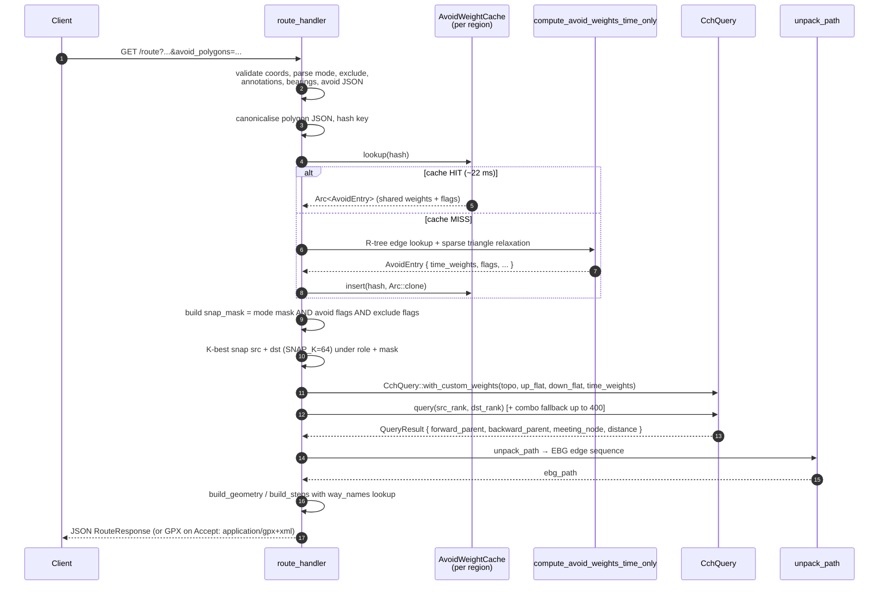

# Butterfly-route API reference

Static endpoint reference, generated from source (`route/src/server/*.rs`). For live, interactive docs hit Swagger UI at `http://<host>:3001/swagger-ui` while the server is running.

See also: [Quickstart](quickstart.md), [Deployment](deployment.md), [Architecture](architecture.md), [Troubleshooting](troubleshooting.md).

## Transport overview

| Transport | Port | Wire format | Use for |
|-----------|------|-------------|---------|
| REST (Axum) | 3001 | JSON request / JSON response (content-negotiated on `/route`, `/isochrone`) | Human-facing clients, dashboards, single queries |
| gRPC Flight (tonic) | 3002 | Arrow IPC (`DoGet` ticket + record-batch stream) | Machine-facing bulk pipelines, polars/duckdb consumers |

Architectural rule: **REST stays JSON, Flight stays Arrow.** New bulk Arrow endpoints land on Flight, not on Axum. `/isochrone/bulk` is a pre-Flight exception (length-prefixed WKB stream over HTTP).

Coordinates are always `[longitude, latitude]` (GeoJSON order). Transport modes depend on what models were built at pipeline time — typically `car`, `bike`, `foot` on the Belgium dataset.

Server-wide layers (defined in `route/src/server/api.rs`):

- `ConcurrencyLimitLayer(32)` on every non-streaming route
- `TimeoutLayer(120s)` on every non-streaming route, `TimeoutLayer(600s)` on `/isochrone/bulk`
- `DefaultBodyLimit(256 MiB)` on `/isochrone/bulk`
- `CompressionLayer` (gzip + brotli) on non-streaming routes
- Permissive CORS
- `CatchPanicLayer` (panics turn into 500 instead of dropping the connection)
- Prometheus metrics exposed at `GET /metrics`

---

## REST endpoints

### `GET /route`

Point-to-point routing with geometry, optional turn-by-turn steps with road names, and optional alternatives. Source file: `route/src/server/route.rs`.

**Request**

| Param | Type | Default | Notes |
|-------|------|---------|-------|
| `src_lon`, `src_lat` | f64 | required | Source coordinate |
| `dst_lon`, `dst_lat` | f64 | required | Destination coordinate |
| `mode` | string | required | `car` / `bike` / `foot` (or any loaded mode) |
| `traffic` | string | none | Maps to synthetic mode `<mode>_<traffic>` (e.g. `rush_hour`). Variant must exist from `step8-customize --traffic`. |
| `geometries` | string | `polyline6` | `polyline6` / `geojson` / `points` |
| `alternatives` | u32 | `0` | Up to 5 alternative routes (penalty-based) |
| `steps` | bool | `false` | Include turn-by-turn instructions with road names |
| `annotations` | string | none | Comma list of `duration`, `distance`, `speed`, `nodes` |
| `bearings` | string | none | `angle,range;angle,range` (source;destination), angle 0-360, range 0-180 |
| `exclude` | string | none | Comma list of `toll`, `ferry`, `motorway` |
| `avoid_polygons` | string | none | JSON `[[lon,lat],...]` or `[[[lon,lat],...],...]` |
| `debug` | bool | `false` | Include snap diagnostics in response |

Content negotiation:
- `Accept: application/json` (default) → JSON `RouteResponse`
- `Accept: application/gpx+xml` → GPX 1.1 XML track

**Response (JSON)**

| Field | Type |
|-------|------|
| `duration_s` | f64 |
| `distance_m` | f64 |
| `geometry` | RouteGeometry (polyline6 string, or GeoJSON LineString, or array of `{lon, lat}`) |
| `steps` | array of `RouteStep` (if `steps=true`) |
| `annotations` | object with optional `duration` / `distance` / `speed` / `nodes` arrays |
| `alternatives` | array of `RouteAlternative` (if `alternatives>0`) |
| `debug` | `{ src_snapped, dst_snapped }` (if `debug=true`) |

**Errors**

| Status | Cause |
|--------|-------|
| 400 | Invalid coord, unknown mode, bad bearing/exclude/annotation token, bad traffic variant, unsnappable point |
| 404 | No route found after K-best snap fallback (up to 400 combos) |

**Notes**

- K-best snap with `SNAP_K=64` per role + bounded combo fallback (max 400) — see `route.rs:476-498`.
- Avoid-polygon recustomisation result cached per-region; cache capacity from `BUTTERFLY_AVOID_CACHE_CAP` (default 8), see `route/src/server/avoid.rs`. Hits cost ~22 ms vs ~0.8–1.2 s for a cold recustomise (#240 incremental BFS — polygon-size dependent, was ~37 s pre-#240); surfaced in `/health.avoid_cache`.
- Same-edge src/dst short-circuits to zero-distance result.
- Cross-region routing is handled via the overlay cluster (#91 Phase 2) when multiple regions are loaded; same-region queries take the fast intra-region path.
- See [Architecture: routing pipeline](architecture.md) for the CCH P2P + path-unpack flow.

---

### `GET /nearest`

Snap a coordinate to the nearest road segments accessible by a given transport mode. Source: `route/src/server/nearest.rs`.

**Request**

| Param | Type | Default | Notes |
|-------|------|---------|-------|
| `lon`, `lat` | f64 | required | Query coordinate |
| `mode` | string | required | Transport mode |
| `number` | u32 | `1` | 1-100 results (returns 400 on `0` or `>100`) |
| `role` | string | `src` | Directional filter: `src` / `dst` / `either` (#197) |

**Response**

```
{ "code": "Ok", "waypoints": [{ "location": [lon,lat], "distance": meters, "edge_length_m": ... }, ...] }
```

**Errors**

- 400 — invalid coord, `number=0`, `number>100`, no road within snap radius

**Notes**

- `Src` filters to candidates with outbound capability for this mode; `Dst` filters to inbound; `Either` is the unfiltered legacy snap.
- Bike/foot are effectively undirected so all three roles converge.

---

### `POST /table`

Many-to-many distance/duration matrix using Bucket M2M CH. Source: `route/src/server/table.rs`.

**Request body (JSON)**

| Field | Type | Default | Notes |
|-------|------|---------|-------|
| `sources` | `[[lon,lat], ...]` | required | One or more |
| `destinations` | `[[lon,lat], ...]` | required | One or more |
| `mode` | string | required | Transport mode |
| `annotations` | string | `"duration"` | `duration`, `distance`, or `duration,distance` |
| `exclude` | string | none | Same tokens as `/route` |
| `avoid_polygons` | string | none | Same shape as `/route` |
| `radius_km` | number / `"auto"` / null | none | Euclidean pre-filter; pairs beyond are emitted as `null` |

Hard cap: `sources × destinations ≤ 10_000_000` cells. Larger workloads must use the Flight `matrix` action (port 3002).

**Response (OSRM-compatible)**

```
{
  "code": "Ok",
  "durations": [[seconds | null, ...], ...],     // present if duration requested
  "distances": [[meters | null, ...], ...],      // present if distance requested
  "sources":      [{ "location": [lon,lat], "name": "" }, ...],
  "destinations": [{ "location": [lon,lat], "name": "" }, ...]
}
```

Unreachable cells are `null`. `distances` are shortest-distance routes (separate metric from time-optimal `durations`).

**Errors**

- 400 — empty sources/destinations, invalid coord, matrix too large, bad annotation/exclude token, mixed-region inputs

**Notes**

- `use_parallel` threshold: `≥ 2500` cells uses `table_bucket_parallel` (rayon over sources), smaller uses sequential `table_bucket_full_flat`.
- K-best snap (`SNAP_K=64`) parallelised over src/dst with rayon. Per-cell K-best fallback (max 200 combos per cell) patches cells the primary snap couldn't connect.
- Avoid-cache shared with `/route` and `/trip` (`BUTTERFLY_AVOID_CACHE_CAP`).
- Performance (Belgium, 8 threads, from CLAUDE.md): 50×50 = 12 ms, 100×100 = 32 ms, 500×500 = 116 ms, 1000×1000 = 268 ms, 5000×5000 = 5.5 s, 10000×10000 = 18.3 s — **1.4×–2.56× faster than OSRM CH** across the 50–10000 range.

---

### `POST /table/stream` *(not mounted in current build)*

The HTTP Arrow streaming endpoint exists in source (`table.rs::table_stream_handler`) but is not wired into the router (`api.rs:104`). Its replacement is the Flight `matrix` action on port 3002, which has the same semantics with proper Arrow Flight framing.

Historical performance (when mounted): 10k×10k in 24 s, 50k×50k (2.5 B distances) in 9.5 min with 2.4 GB RAM overhead via tile-by-tile streaming.

---

### `POST /trip`

TSP/trip optimisation: multi-start nearest-neighbor + 2-opt + or-opt over an N×N duration matrix. Source: `route/src/server/trip.rs`.

**Request body (JSON)**

| Field | Type | Default | Notes |
|-------|------|---------|-------|
| `coordinates` | `[[lon,lat], ...]` | required | 2-100 waypoints |
| `mode` | string | `"car"` | Transport mode |
| `round_trip` | bool | `true` | If false: open path, fixed start at waypoint 0 |
| `annotations` | string | `"duration"` | `duration`, `distance`, or `duration,distance` |
| `exclude` | string | none | Same tokens as `/route` |
| `avoid_polygons` | string | none | Same shape as `/route` |

**Response**

```
{
  "code": "Ok" | "Partial",
  "waypoints": [{ "location": [lon,lat], "waypoint_index": ..., "trips_index": 0, "name": "" }, ...],
  "trips": [{
    "legs": [{ "duration": s | null, "distance": m | null, "summary": "" }, ...],
    "duration": s, "distance": m, "weight": s,
    "weight_name": "duration",
    "improvement_pct": <2-opt vs greedy>
  }]
}
```

Unreachable legs emit `null` durations / distances (not `0.0`).

**Errors**

- 400 — `< 2` or `> 100` waypoints, invalid coord, unknown mode/annotation token, mixed-region inputs

---

### `GET /isochrone`

Reachability polygon using PHAST. Source: `route/src/server/isochrone_handler.rs`.

**Request**

| Param | Type | Default | Notes |
|-------|------|---------|-------|
| `lon`, `lat` | f64 | required | Origin |
| `time_s` | u32 | none | 1-7200 seconds. Exactly one of `time_s` / `distance_m` / `contours` must be set. |
| `distance_m` | u32 | none | 1-100000 meters |
| `contours` | string | none | Comma list of seconds, 1-10 values, each 1-7200 |
| `mode` | string | required | Transport mode |
| `direction` | string | `depart` | `depart` (forward) or `arrive` (reverse PHAST) — case-insensitive |
| `geometries` | string | `polyline6` | `polyline6` / `geojson` / `points` |
| `include` | string | none | `network` adds reachable road segments |
| `exclude` | string | none | Same tokens as `/route` |
| `avoid_polygons` | string | none | Same shape as `/route` |

Content negotiation:
- `Accept: application/json` (default) → `IsochroneResponse`
- `Accept: application/octet-stream` → raw WKB polygon (single contour only)

**Response (JSON)**

```
{
  "contours": [{
    "time_s": ..., "distance_m": ...,           // one of these is set
    "polygon" | "polygon_geojson" | "polygon_points": ...,
    "reachable_edges": ...
  }, ...],
  "network": [[[lon,lat], ...], ...]   // only if include=network
}
```

Polygon ring orientation is enforced CCW for outer rings (GeoJSON spec). JSON coordinate precision is 5 decimals (~1 m) since contours come from a 30 m raster grid.

**Errors**

- 400 — invalid coord/mode, missing or multiple metric (must provide exactly one), out-of-range threshold, invalid direction, bad geometry format

**Notes**

- Block-gated downward PHAST + thread-local state — 5 ms p50 on the 30-min car case (CLAUDE.md). 815/sec for JSON, 814/sec for WKB.
- Reverse isochrone (`direction=arrive`) uses plain linear-scan downward (PUSH+block-gating is broken for reverse PHAST — see MEMORY.md).

---

### `POST /isochrone/bulk`

Parallel batch isochrones (rayon-fanned PHAST), returns a length-prefixed WKB stream. Source: `route/src/server/isochrone_handler.rs:1062`.

**Request body**

| Field | Type | Notes |
|-------|------|-------|
| `origins` | `[[lon,lat], ...]` | Max 10000 |
| `time_s` | u32 | 1-7200 |
| `mode` | string | Transport mode |
| `exclude` | string | optional |
| `avoid_polygons` | string | optional |

**Response (binary, `application/octet-stream`)**

Per origin: `[u32 LE origin_idx][u32 LE wkb_len][N bytes WKB polygon]`.

**Errors**

- 400 — empty origins, too many (>10000), invalid coord, out-of-range `time_s`, mixed-region origins

**Notes**

- 256 MB request body limit, 600 s request timeout, concurrency limit 4 (memory-intensive).
- Cooperative cancellation on client disconnect via atomic flag checked inside the rayon worker.
- 1526 iso/sec on Belgium (CLAUDE.md).

---

### `POST /catchment`

Per-store catchment polygons: for each store, run 1-to-N matrix against clients, then build a percentile hull. Source: `route/src/server/catchment.rs`.

**Request body**

| Field | Type | Notes |
|-------|------|-------|
| `mode` | string | required |
| `hull_mode` | enum | `convex` / `concave` / `isochrone` |
| `percentiles` | `[f32]` | required, each 0-100 |
| `remove_outliers` | bool | default `true` |
| `stores` | `[{ id, lon, lat }]` | required |
| `clients` | `[{ lon, lat }]` | required |
| `radius_km` | number / `"auto"` / null | optional Euclidean pre-filter, per-store |

**Response**

```
{ "results": [{
    "store_id": "...",
    "percentile": 80.0,
    "threshold_seconds": ...,
    "clients_covered": u32,
    "clients_total": u32,
    "polygon_wkb_base64": "..."
}, ...] }
```

**Errors**

- 400 — empty stores or percentiles, invalid coord, percentile out of `[0, 100]`, mixed-region inputs

---

### `POST /match`

Map-match a GPS trace to the road network using HMM + Viterbi (Newson & Krumm 2009). Source: `route/src/server/matching.rs`.

**Request body**

| Field | Type | Default | Notes |
|-------|------|---------|-------|
| `coordinates` | `[[lon,lat], ...]` | required | At least 2, max 500 |
| `mode` | string | `"car"` | Transport mode |
| `gps_accuracy` | f64 | `10` | Meters |
| `geometry` | string | `"polyline6"` | Same set as `/route` |
| `steps` | bool | `false` | Turn-by-turn |
| `exclude` | string | none | |
| `avoid_polygons` | string | none | |

**Response**

```
{
  "code": "Ok",
  "matchings": [{
    "geometry": ...,
    "duration": s, "distance": m,
    "confidence": 0..1,
    "steps": [...]  // if requested
  }, ...],
  "tracepoints": [ { location, name, matchings_index, waypoint_index } | null, ... ]
}
```

**Errors**

- 400 — `< 2` coordinates, invalid coord, unknown mode
- 404 — no match

**Notes**

- Candidate selection uses spatial-index midpoints (topologically reliable); perpendicular projection is used only for emission probability and snap position. ~5 s for a 10-point trace; ~500 ms per transition step (CLAUDE.md / MEMORY.md).
- Cross-region matching (#194) supported when an overlay cluster is loaded.

---

### `GET /height`

Elevation lookup from SRTM `.hgt` tiles. Source: `route/src/server/height_handler.rs`.

**Request**

| Param | Type | Notes |
|-------|------|-------|
| `coordinates` | string | Pipe-separated `lon,lat` pairs, e.g. `4.35,50.85\|4.40,50.86` (URL-encode the pipe). Max 10000. |

**Response**

```
{ "elevations": [{ "lon": ..., "lat": ..., "elevation": meters | null }, ...] }
```

`null` for coordinates outside SRTM coverage.

**Errors**

- 400 — empty / malformed coordinate string, too many coordinates
- 503 — elevation data not loaded (no SRTM tiles in `data/srtm/`)

---

### `GET /transit`

Single multimodal transit journey: access leg (any road mode) → RAPTOR rounds (any merged GTFS/NeTEx feed) → egress leg. Source: `route/src/server/transit_handler.rs`.

**Request**

| Param | Type | Default | Notes |
|-------|------|---------|-------|
| `origin_lon`, `origin_lat` | f64 | required | |
| `dest_lon`, `dest_lat` | f64 | required | |
| `depart` | string | `08:00:00` | `HH:MM` or `HH:MM:SS`, service-local time |
| `access_mode` | string | `foot` | Any loaded road mode |
| `egress_mode` | string | same as `access_mode` | |
| `max_access_m` | u32 | per-mode: foot 2000, bike 8000, car 30000 | |
| `max_egress_m` | u32 | per-mode | |
| `max_walk_m` | u32 | none | Deprecated alias when both modes are `foot` |
| `max_access_stops` | usize | foot 20, bike 60, car 500, other 100 | |
| `walk_speed_mps` | f64 | `1.3` | Only used when access mode is foot |
| `geometry` | string | `straight` | `straight` (endpoints only) or `full` (routed polyline via CCH unpack) |

**Response**

```
{
  "origin": [lon,lat], "destination": [lon,lat],
  "depart_time": "HH:MM:SS", "arrival_time": "HH:MM:SS",
  "total_duration_s": u32,
  "access_mode": "foot", "egress_mode": "foot",
  "legs": [
    { "type": "walk" | "drive" | "road", "from": [lon,lat], "to": [lon,lat],
      "duration_s": ..., "distance_m": ..., "geometry": [...]? },
    { "type": "transit", "from_stop_id": "sncb:8814001", "from_stop_name": "...",
      "from": [...], "to_stop_id": "...", "to_stop_name": "...", "to": [...],
      "board_time": "HH:MM:SS", "alight_time": "HH:MM:SS", "duration_s": ...,
      "route_short_name": "...", "route_long_name": "...", "headsign": "..." }
  ]
}
```

**Errors**

- 400 — bad params / mode
- 503 — transit subsystem not loaded (no feeds configured at boot)

**Notes**

- Single-region only (#91 Phase 1). Transit always uses the primary region's foot CCH + merged timetable.
- 35 ms p50 warm (CLAUDE.md, 4 feeds merged on Belgium).

---

### `POST /transit/bulk`

Batch multimodal routing. Source: `route/src/server/transit_handler.rs:966`.

**Request body**

| Field | Type | Notes |
|-------|------|-------|
| `queries` | array of `TransitRequest` | Max 100000 |
| `max_walk_m` | u32 | Per-batch default for any query that omits the field |
| `access_mode` | string | Per-batch default |
| `egress_mode` | string | Per-batch default |

**Response**

```
{ "count": N, "results": [
    { "kind": "ok", "journey": { ... TransitResponse ... } }
  | { "kind": "err", "status": 400, "error": "..." }
] }
```

**Errors**

- 413 — batch larger than 100000
- 503 — transit subsystem not loaded

**Notes**

- Origin grouping (#120): queries with the same quantised origin + access params share the access fan-out (snap + R-tree + CCH 1-to-N).
- Sustained 311 q/s on 1000 varied queries; 7× speed-up on 20 same-origin queries vs serial (CLAUDE.md).
- For larger / Arrow-shaped workloads use the Flight `transit_bulk` action (port 3002, up to 500000 queries per call).

---

### `GET /health`

Health snapshot. Source: `route/src/server/health_handler.rs`.

**Response**

```
{
  "status": "ok",
  "version": "...",
  "uptime_s": u64,
  "modes": ["bike", "car", "foot"],
  "data_dir": "...",
  "nodes_count": ..., "edges_count": ..., "named_roads_count": ...,
  "regions_count": ..., "regions": ["belgium"],
  "total_nodes_count": ..., "total_edges_count": ...,
  "verify_status": "ok" | "verified" | "pending" | "degraded",
  "verify": { "n_sections": ..., "n_verified": ..., "n_unverified": ...,
              "n_verifying": ..., "n_failed": ..., "failed": [...] },
  "avoid_cache": [{ "region": ..., "hits": u64, "misses": u64,
                    "hit_rate": 0..1, "size": ..., "capacity": ... }, ...]
}
```

Status field is always `"ok"` while the server can answer requests. `verify_status` and `avoid_cache` are the operational signals; tune `BUTTERFLY_AVOID_CACHE_CAP` based on the hit rate.

---

### `GET /metrics`

Prometheus exposition (text format). Plain `axum_prometheus::PrometheusMetricLayer` register, plus avoid-cache stats mirrored at every `/health` scrape (`record_avoid_cache_stats`).

No request params.

---

### `GET /regions`

Per-region listing (multi-region deploys). One row per loaded region with `id`, snap-bounding box, node/edge counts. Source: `route/src/server/regions_handler.rs`.

---

## gRPC Flight actions (port 3002)

Ticket format (verified from `route/src/server/flight.rs:81-98`):

```
<action>:<profile>:<json_params>
```

- `<action>` — `matrix` / `route_batch` / `isochrone` / `transit_bulk` / `edges_batch`
- `<profile>` — any loaded mode (looked up case-insensitively)
- `<json_params>` — UTF-8 JSON, action-specific shape

`catchment` is exposed via `DoExchange` rather than `DoGet`: send batches with `flight_descriptor.cmd = "catchment:<profile>:<json>"` (input columns: `store_id:utf8, store_lon:f64, store_lat:f64, client_lon:f64, client_lat:f64`).

Common output: a stream of Arrow `RecordBatch`es. Bound-checking errors surface as `tonic::Status::invalid_argument`. Service unavailable (transit not loaded) → `failed_precondition`.

### Action: `matrix`

Params:

```json
{ "sources": [[lon,lat], ...],
  "destinations": [[lon,lat], ...],
  "radius_km": <number | "auto" | null> }
```

Output schema:

| Column | Arrow type | Notes |
|--------|------------|-------|
| `source_idx` | u32 | Original input position |
| `target_idx` | u32 | |
| `duration_ms` | u32 | `u32::MAX` for unreachable |
| `distance_m` | u32 | `u32::MAX` (distance not computed under the time metric in this action) |

### Action: `route_batch`

Params:

```json
{ "pairs": [[src_lon, src_lat, dst_lon, dst_lat], ...] }
```

Max 100000 pairs. Chunked into 1000-pair RecordBatches.

| Column | Arrow type | Notes |
|--------|------------|-------|
| `src_lon`, `src_lat`, `dst_lon`, `dst_lat` | f64 | Echo of input |
| `duration_s` | f32 | `NaN` on no-route |
| `distance_m` | f32 | `NaN` on no-route |
| `geometry_wkb` | binary | Little-endian LineString WKB, empty bytes when no route |

Each pair gets K-best snap (`SNAP_K=64`) + bounded combo fallback (mirror of `/route`).

### Action: `isochrone`

Params:

```json
{ "lon": f64, "lat": f64,
  "intervals": [u32, ...],    // seconds, 1-10 values each 1-7200
  "direction": "depart" | "arrive" }
```

| Column | Arrow type | Notes |
|--------|------------|-------|
| `interval_s` | u32 | |
| `polygon_wkb` | binary | WKB Polygon, CCW outer ring |

### Action: `catchment` *(DoExchange)*

Descriptor cmd: `catchment:<profile>:<params>` with params

```json
{ "percentiles": [50, 80], "hull_mode": "isochrone" | "convex" | "concave",
  "remove_outliers": true }
```

Input schema:

| Column | Arrow type |
|--------|------------|
| `store_id` | utf8 |
| `store_lon`, `store_lat` | f64 |
| `client_lon`, `client_lat` | f64 |

Output: per-store × per-percentile rows (`catchment_arrow_schema`):

| Column | Arrow type |
|--------|------------|
| `store_idx` | u32 |
| `store_id` | utf8 |
| `percentile` | f32 |
| `threshold_seconds` | f32 |
| `clients_covered`, `clients_total` | u32 |
| `polygon_wkb` | binary |

### Action: `transit_bulk`

Params (`route/src/server/flight.rs:1166`):

```json
{ "queries": [ { ...TransitRequest... }, ... ],
  "max_walk_m": u32?, "access_mode": string?, "egress_mode": string? }
```

Max 500000 queries. The `profile` portion of the ticket is ignored — every query carries its own `access_mode`/`egress_mode`. Chunked into 1024-row RecordBatches.

| Column | Arrow type | Nullable |
|--------|------------|----------|
| `query_idx` | u32 | no |
| `status` | utf8 (`"ok"` / `"err"`) | no |
| `http_status` | u16 (200, 4xx, 5xx) | no |
| `error` | utf8 | yes |
| `origin_lon`, `origin_lat`, `dest_lon`, `dest_lat` | f64 | no |
| `depart_time`, `arrival_time` | utf8 | yes |
| `total_duration_s` | u32 | yes |
| `access_mode`, `egress_mode` | utf8 | yes |
| `legs_json` | utf8 | yes — JSON-encoded leg array |

`legs_json` is JSON rather than native `List<Struct>` because the transit-leg enum has four tagged variants with up to 12 nullable fields including `Arc<str>` route metadata.

### Action: `edges_batch`

Params (`route/src/server/flight.rs:914`):

```json
{ "pairs": [[src_lon, src_lat, dst_lon, dst_lat], ...] }
```

Max 500000 pairs. Chunked at 256 pairs per RecordBatch (≈5000 rows after ~20-edge average path).

| Column | Arrow type | Nullable |
|--------|------------|----------|
| `query_idx` | u32 | no |
| `target_idx` | u32 | no (placeholder 0 in the flat MVP shape) |
| `edge_seq` | u32 | yes — null marks unreachable pair |
| `osm_node_from`, `osm_node_to` | i64 | yes |
| `duration_ms`, `distance_m` | u32 | yes |

**Continuity invariant:** within a `(query_idx, target_idx)` group, consecutive rows satisfy `osm_node_to[i] == osm_node_from[i+1]`. Unreachable pairs emit exactly one row with all edge columns null.

Designed for flow analytics / traffic-assignment / emissions inventory — the unnested shape is deliberate (per the #125 ticket: nested `list<struct>` fights every downstream tool).

---

## End-to-end flow: `/route` with `avoid_polygons`



Cache key is a quantised, deduped hash of the polygon JSON (`avoid.rs:hash_avoid_payload` — 6-decimal quantisation, ring rotation-normalised). Cache capacity is set by `BUTTERFLY_AVOID_CACHE_CAP` (default 8); current hit / miss / size / capacity is surfaced via `/health.avoid_cache` and Prometheus.

---

## Status codes

| Status | When |
|--------|------|
| 200 | Success — including "no route" when the response body itself carries the failure (e.g. `TripLeg.duration = null`) |
| 400 | Validation: bad coord, bad mode, bad token (annotation/exclude/bearing/direction), empty required field, matrix too large, batch too large for the JSON endpoint, mixed-region inputs to a same-region endpoint |
| 404 | `/route` only: no path between src and dst after the K-best fallback |
| 408 | Request timeout — 120 s on most endpoints, 600 s on `/isochrone/bulk`; emitted by `TimeoutLayer` |
| 413 | `/transit/bulk` batch larger than 100000 |
| 500 | Internal bug. Panics are caught by `CatchPanicLayer` and turned into 500 instead of dropping the connection |
| 503 | Subsystem unavailable: `/height` with no SRTM tiles loaded, `/transit*` with no feeds loaded |

REST error body shape (`route/src/server/types.rs::ErrorResponse`):

```json
{ "error": "human-readable message" }
```

`/trip` uses a slightly different shape (`{ "code": "InvalidValue", "message": "..." }`) for OSRM compatibility on validation paths.

Flight errors surface as `tonic::Status` with codes `InvalidArgument` (validation / unknown action / bad ticket), `FailedPrecondition` (transit not loaded), and `Internal` (Arrow encoding errors).
