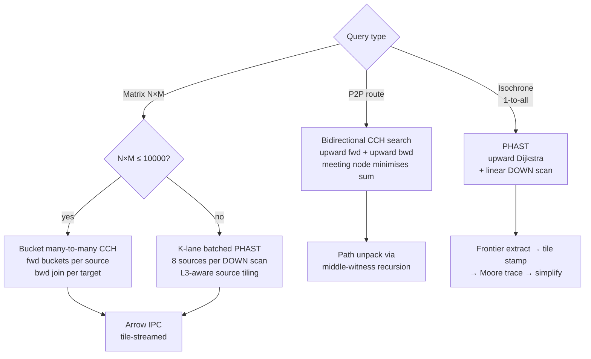
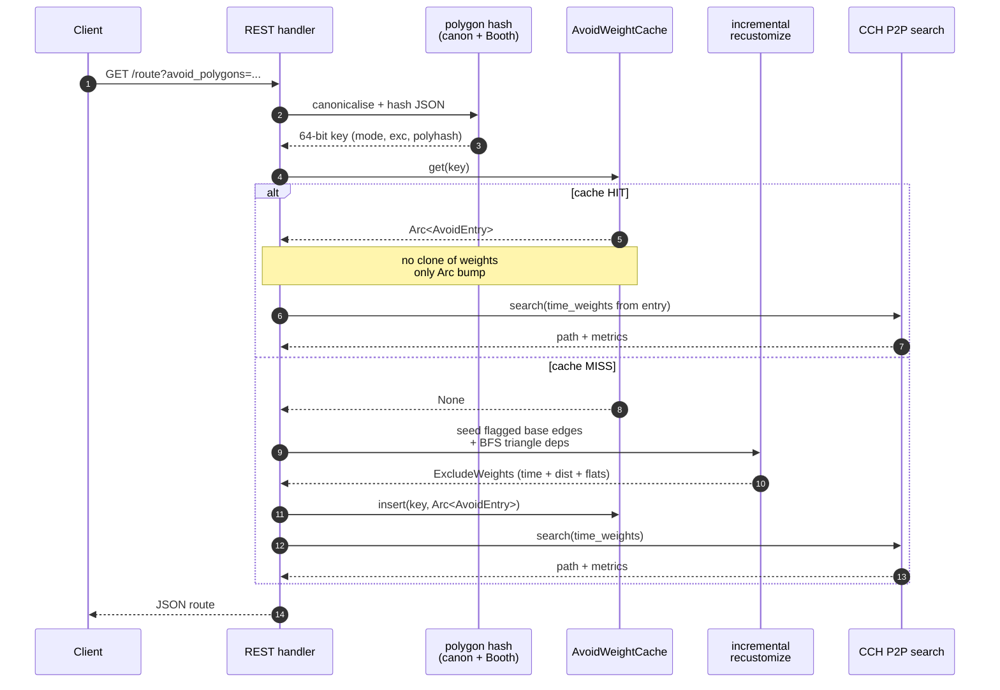
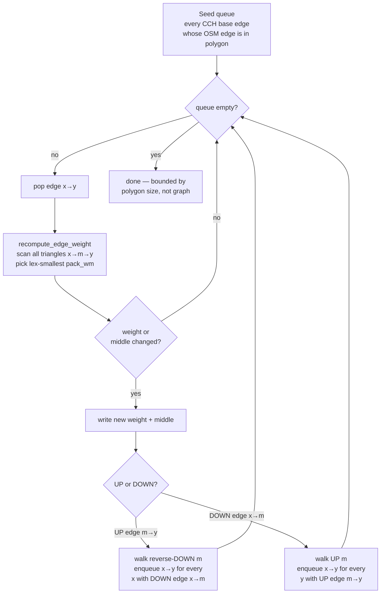
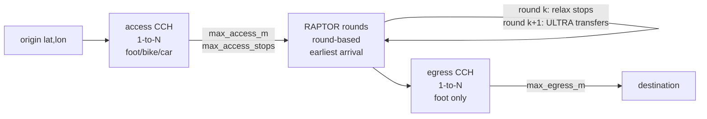
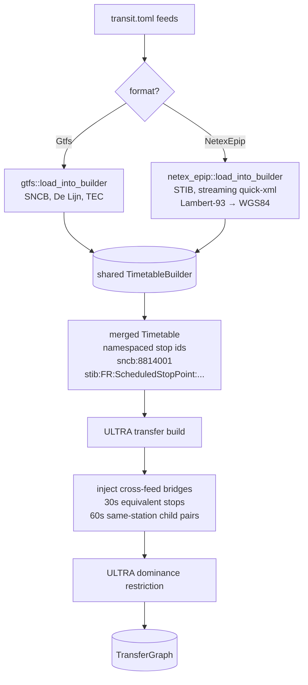

# Butterfly-route architecture

This document explains how `butterfly-route` works under the hood: which graph
the engine routes on, why, how queries are dispatched, and where the marquee
performance/feature mechanisms live in the source tree.

For the user-facing endpoint surface (REST + Flight), see
[API reference](api.md).

---

## 1. Why edge-based CCH

`butterfly-route` is built on a **Customizable Contraction Hierarchy** whose
state is a **directed edge id**, not a node id. That choice is the single most
load-bearing decision in the codebase, so it gets paid back in every other
section.

In a classic node-based CH (what OSRM uses):

- The Dijkstra label is a node.
- A turn restriction (`no_u_turn`, `no_right_on_red`, banned right-on-red from
  way A onto way B) cannot be encoded as a node property — it is a property
  of the *transition* between two incident ways.
- The CH preprocessing therefore either ignores turn restrictions (OSRM's
  matrix path) or approximates them by collapsing forbidden transitions into
  larger penalties that fight with shortest-path semantics.

Butterfly's edge-based graph (EBG) replaces every original road edge with a
*directed edge node*. A turn from edge `e_in` to edge `e_out` is a literal
arc `e_in → e_out`, and its cost is `cost(e_in) + turn_penalty(e_in, e_out)`.
That makes turn restrictions **structural**: a forbidden turn is just an
absent arc.

The trade-off is real:

| Aspect             | OSRM (node-based)  | Butterfly (edge-based) |
|--------------------|--------------------|------------------------|
| Routing state      | Node id            | Directed edge id       |
| Belgium graph size | ~1.9M nodes        | ~5M edge-states (~2.5x)|
| Turn restrictions  | Approximated/ignored | Exact                |
| CH preprocessing   | Simpler            | More shortcuts, more work |

The "one graph, one hierarchy, one query engine" invariant in
`CLAUDE.md` follows directly: routes, matrices, isochrones, transit access
legs and avoid-polygon recustomization all run on the **same** EBG-based CCH.
That means a turn restriction that affects routing also affects matrix
distances and isochrone reach — they cannot drift.

---

## 2. The pipeline

`butterfly-route` builds its routing artifacts in 8 explicit, lockable steps.
Each step writes a deterministic, CRC-checked binary file and a
`stepN.lock.json` manifest. The serve binary mmaps the step-8 outputs at boot.

```mermaid
flowchart LR
    pbf[(belgium.pbf)]
    s1[step1-ingest]
    s2[step2-profile]
    s3[step3-nbg]
    s4[step4-ebg]
    s5[step5-weights]
    s6[step6-order]
    s7[step7-contract]
    s8[step8-customize]
    serve[serve]

    pbf --> s1
    s1 --> |nodes.sa<br/>nodes.si<br/>ways.raw<br/>relations.raw| s2
    s2 --> |way_attrs.MODE.bin<br/>turn_rules.MODE.bin| s3
    s3 --> |nbg.nodes<br/>nbg.csr<br/>nbg.geo| s4
    s4 --> |ebg.nodes<br/>ebg.csr<br/>ebg.turn_table| s5
    s5 --> |w.MODE.u32<br/>t.MODE.u32<br/>mask.MODE.bitset| s6
    s6 --> |order.MODE| s7
    s7 --> |cch.topo.MODE| s8
    s8 --> |cch.w.MODE.u32<br/>cch.w.MODE_VARIANT.u32| serve
```



- **step1-ingest** — Parse PBF into raw sorted arrays. No semantics, just OSM
  bytes laid out for streaming.
- **step2-profile** — Apply the declarative JSON profile (`*.model.json`) to
  every way and turn restriction. Produces per-mode attribute arrays. This is
  where density classes (urban_high…rural) get baked in for traffic
  recustomization (#84).
- **step3-nbg** — Build a Node-Based Graph. **Build-time intermediate only**:
  the NBG geometry is preserved (for polyline reconstruction) but the NBG
  topology is discarded after step 4.
- **step4-ebg** — Convert NBG → EBG. Every directed road edge becomes an EBG
  node; every legal turn becomes an EBG arc. Turn restrictions live in
  `ebg.turn_table`.
- **step5-weights** — Per-mode weights (time and distance) and the snap mask
  bitsets. The mask says "this EBG node is accessible to mode M with at least
  one outbound *and* one inbound arc connected to the routing core".
- **step6-order** — Nested-dissection ordering on the **filtered EBG**
  (per-mode). The lifted-from-NBG shortcut (mode-agnostic ordering reused
  across modes) produced catastrophic contraction in tests (truck on Belgium:
  1053M shortcuts vs 27.6M, 38× worse). Step 7 warns if the resulting ratio
  exceeds 50× — see `MEMORY.md → Ordering Quality`.
- **step7-contract** — CCH contraction. Emits UP/DOWN edge CSRs plus the
  shortcut → triangle witness table.
- **step8-customize** — Apply the step-5 weights to the contracted hierarchy
  (bottom-up + triangle relaxation). The triangle relaxation phase is
  ~98% of step-8 wall time on Belgium (43 s freeflow car) and is
  **correctness-critical**: skipping it produces wildly wrong paths
  (Brussels–Antwerp went 77 km / 5583 s without relaxation vs the correct
  45 km / 1947 s).

Step 8 optionally writes traffic-variant weight files
(`cch.w.car_rush_hour.u32`, …) by applying per-density-class speed factors.
At boot, the server auto-discovers these and exposes them as synthetic modes
(`?traffic=rush_hour` query parameter).

---

## 3. Query model

Three query shapes, three algorithms, one CCH:



The selection logic lives in `route/src/matrix/` and
`route/src/server/table.rs`. Justifications:

- **P2P uses bidirectional CCH search** because it has the lowest constant
  factor for single-pair queries (~25 ms on Belgium for a Brussels→Antwerp
  car query) and integrates with the version-stamped `CchQueryState`
  thread-local so per-query init is O(1).
- **Isochrones use PHAST** because they need *all* reachable nodes; PHAST's
  linear DOWN scan in rank order is bandwidth-optimal for the full distance
  field and beats a Dijkstra-with-threshold by ~18×
  (90 ms → 5 ms p50 after block-gating).
- **Small matrices use Bucket M2M** because it only explores paths to the
  *requested* targets. For 50×50 the bucket variant touches ~5% of the
  graph; PHAST would touch 100%.
- **Large matrices use K-lane PHAST** because at ≥1000 sources the
  per-source forward search becomes the bottleneck and batching 8 sources
  through one DOWN scan amortises the memory-access cost (cache miss rate
  is 80–87% — bandwidth is the limit, not CPU).

The bucket M2M's directed-graph correctness invariant deserves an explicit
call-out:

```
d(s → t) = min over middle m of d(s → m) + d(m → t)

source phase   : forward UP search   → d(s → m)
target phase   : REVERSE search on   → d(m → t)
                 DownReverseAdjFlat    (NOT d(t → m)!)
```

In a directed graph `d(t → m) ≠ d(m → t)`. The reverse adjacency
(`route/src/matrix/bucket_ch.rs::DownReverseAdjFlat`) is what makes the
target phase actually search backward, not just "in the other direction".

---

## 4. The avoid_polygons fast path (#240)

`avoid_polygons=[[lon,lat],…]` lets the client penalise edges inside a user
polygon. Naively this requires a fresh CCH customization (~30 s on Belgium
for any polygon, because the bottom-up rebuilds every shortcut weight). The
#240 silver bullet does two things to make repeat queries cheap:

1. **Incremental recustomization** — seed only the base edges actually in the
   polygon, BFS-propagate via triangle dependencies, stop when the queue
   empties. Work is bounded by polygon size, not graph size.
2. **Bounded LRU cache** keyed by `(mode, polygon_hash, exclude_mask)`. The
   polygon hash is canonicalised (6-decimal quantisation, Booth's
   lex-minimal-rotation, ring sort) so byte-different but
   geometrically-identical polygons collide. Default capacity 8 entries
   (~1.6 GB ceiling); override via `BUTTERFLY_AVOID_CACHE_CAP`.

Measured wall time on Belgium:

| Polygon size  | Cold MISS (incremental) | Warm HIT (`Arc::clone`) |
|---------------|-------------------------|-------------------------|
| 1 km rural    | ~780 ms                 | ~22 ms                  |
| Old code      | ~37 s                   | n/a                     |

Sequence for a single `/route?avoid_polygons=…` request:



The BFS itself is the heart of `exclude.rs::recustomize_weights_incremental`:



The triangle witness is encoded as `pack_wm(weight, middle)` — a single u64
with weight in the high 32 bits, middle rank in the low 32, so a min over the
packed value gives a deterministic `(weight, middle)` tuple even on ties.
The lex-min property is what makes the BFS converge: weights only decrease
or hold steady, so the recomputed graph is monotone in iteration count.

The cache stores `Arc<AvoidEntry>` containing time weights, distance
weights, *and* the three flat adjacencies (`UpAdjFlat`, `DownReverseAdjFlat`,
`DownAdjFlat`). One MISS pays for every subsequent /route, /table,
/isochrone, /trip on the same polygon — the entry is shared across endpoints.

---

## 5. The transit subsystem

Multimodal transit is a **first-class peer** of road routing, not an add-on.
It reuses the same `ServerState`, the same foot CCH, and the same packed
snap index.



The pieces:

- **Access leg** — `CchQuery::distances_one_to_many` on the foot/bike/car
  CCH. Bounded by `max_access_m` (radius) and `max_access_stops` (count) to
  cap fan-out.
- **RAPTOR** — round-based earliest-arrival over the merged `Timetable`.
  Thread-local `RaptorState` with generation-stamped scratch arrays gives
  O(1) per-query init.
- **Transfer graph** — ULTRA-preprocessed stop-to-stop, pure foot, built once
  at startup by bounded multi-source Dijkstra over the foot CCH. Cached at
  `transit/transfers.bin` with provenance (CCH fingerprint + feed hash +
  algo version). On Belgium: **66 512 stops, 668 k edges**.
- **Egress leg** — same shape as access, foot mode only.

The Timetable is **merged** across feeds:



Cross-feed bridges are injected **before** the ULTRA dominance restriction
so the restriction drops a synthetic bridge cleanly whenever a shorter real
walking transfer dominates it — no special-casing in the RAPTOR loop.

Calendar handling is asymmetric:

- **GTFS** — `ServiceFilter` applied at load time against today's date.
- **NeTEx-EPIP** — STIB publications are often weeks stale, so
  `compute_active_day_types` tries today's date first; if every period is in
  the past, it remaps today to **the same weekday in the latest published
  period**. Tuesday-today → Tuesday-in-window. Preserves weekday/weekend
  semantics, costs nothing at query time.

Performance on Belgium (4 feeds merged):

| Query                        | Metric                  |
|------------------------------|-------------------------|
| Single `/transit` warm       | 35 ms p50               |
| `/transit/bulk` 20 same-origin | 150 ms (7× vs serial) |
| `/transit/bulk` 1000 varied  | 311 q/s sustained       |

---

## 6. Multi-region dispatch

A single `butterfly-route serve` process can host multiple `*.butterfly`
region containers (e.g. one per country). Each request runs against
**exactly one** region — cross-region overlay is filed as #91 Phase 2,
deferred.

```mermaid
flowchart TD
    req[HTTP request<br/>coords + mode]
    req --> count{n_regions == 1?}
    count -->|yes| fast[single-region fast path<br/>regions[0] wins<br/>downstream K-best snap<br/>validates membership]
    count -->|no| sweep[snap_winner per coord<br/>all regions]
    sweep --> agree{all coords<br/>same region?}
    agree -->|yes| pick[use that region's<br/>ServerState]
    agree -->|no| reject[DispatchError::CrossRegion<br/>HTTP 501 with hint<br/>bump cross-region metric]
    fast --> exec[execute query]
    pick --> exec
    reject --> err[JSON error]
```

The single-region fast path is the production case today and matters: the
previous behaviour (per-coord serial single-best snap across all loaded
regions) cost ~200 ms wall on Belgium at N=100 for `/table` — pure
coordination overhead. The short-circuit hands the request straight to
`regions[0]` and lets the downstream K-best snap inside the matrix handler
do the actual membership check. Coords that don't lie on the road network
get a `Inf` cell, which is the right answer.

`overlay: Option<Arc<OverlayCluster>>` is wired in `RegionsState` and the
`dispatch_p2p_with_overlay` entry point exists, but `OverlayCluster` is
`None` in production until #91 Phase 2 (border nodes + border matrix +
cross-region coordinator) lands.

---

## 7. Performance optimizations summary

The numbers below are the cumulative effect; absolute throughputs at the
top of `CLAUDE.md` already include all of them.

| Optimization                                  | Mechanism                                                | Speedup / effect          |
|-----------------------------------------------|----------------------------------------------------------|---------------------------|
| Edge-based CCH (foundational)                 | Single graph for routes/matrices/isochrones              | exact turns, internal consistency |
| Flat reverse adjacency (embedded weights)     | One contiguous array per `(node, weight)` pair           | eliminates indirection    |
| 4-ary heap + version-stamped distances        | `wrapping_add(1)` per query; no per-call array zeroing   | 0% stale pops, O(1) init  |
| O(1) prefix-sum bucket lookup                 | Per-node bucket offset table                             | -7% matrix time           |
| Bound-aware join pruning                      | Skip joins whose lower bound exceeds best                | -41% joins, -10% time     |
| SoA bucket layout                             | Separate arrays for `(target, dist)` vs interleaved      | -24% matrix time          |
| Thread-local PHAST state                      | `RefCell<Option<PhastState>>`; reinit only on n_nodes change | O(1) per-query init   |
| Thread-local bucket M2M state (parallel fwd+bwd) | Per-thread search arenas                              | 6× at 100×100, 5.5× at 1000×1000 |
| Block-gated downward scan (C1)                | Skip DOWN blocks whose min rank ≥ best frontier dist     | 90 ms → 5 ms iso p50 (18×)|
| L3-aware source tiling (#190)                 | Split source dimension to keep working set L3-resident   | 10k×10k 25.6 s → 18.3 s (28%) |
| Software prefetch on matrix writes (#190)     | `_mm_prefetch` on next-row pointer, gated ≥ 8 MiB        | small gain at large N, no small-N regression |
| Incremental avoid recustomization (#240)      | BFS seeded by polygon-flagged base edges                 | 37 s → 0.78 s MISS, 22 ms HIT |
| Connectivity-aware role snap masks (#197)     | Separate `has_outbound`/`has_inbound` bitsets per mode   | eliminates matrix snap traps |
| Parallel K-best snap (#232)                   | `rayon::par_iter` per-coord snap inside Flight matrix    | 50k×50k 10.94 → 9.61 min (1.14×) |
| mmap-backed container loads (#155)            | Zero-copy weights/topology/geometry                      | RSS down, boot time down  |

Snapshot of the current matrix curve on Belgium (in-process
`butterfly-bench bucket-m2m --parallel`, 2026-05-22):

| Size        | Time     | Throughput  | Notes                          |
|-------------|----------|-------------|--------------------------------|
| 10×10       | 18.6 ms  | 5 365 c/s   | rayon dispatch dominates       |
| 50×50       | 11.5 ms  | 216 K c/s   | faster than OSRM (17 ms)       |
| 1000×1000   | 270.8 ms | 3.7 M c/s   | 2.56× faster than OSRM         |
| 5000×5000   | 4 815 ms | 5.2 M c/s   | 1.45× faster than OSRM         |
| 10000×10000 | 18.1 s   | 5.5 M c/s   | 1.8× faster than OSRM (32.9 s) |

Flight `matrix` end-to-end (clustered city coords, parallel snap):

| Size        | Wall time | Throughput |
|-------------|-----------|------------|
| 1k × 1k     | 3.61 s    | 277 K c/s  |
| 10k × 10k   | 35.5 s    | 2.8 M c/s  |
| 25k × 25k   | 2.88 min  | 3.6 M c/s  |
| 50k × 50k   | 9.61 min  | 4.3 M c/s  |

The gap between in-process (18 s @ 10k²) and Flight (35.5 s) is Arrow IPC
framing + handshake + per-coord parallel K-best snap — not the algorithm.

---

## 8. Memory layout

The server's steady-state RSS on Belgium is ~24 GB per region, dominated by
mmap-backed (page-cache-eligible) regions, not heap. The split:

```mermaid
flowchart TD
    proc[butterfly-route serve<br/>process]

    proc --> mmap[mmap regions<br/>zero-copy, page-cache eligible]
    proc --> heap[heap-resident<br/>anon RSS]
    proc --> tls[thread-local arenas]

    mmap --> mw[CCH weights per mode<br/>cch.w.MODE.u32]
    mmap --> mt[CCH topology per mode<br/>up/down CSRs + middles]
    mmap --> mg[edge geometry #155<br/>flat polyline arena]
    mmap --> mf[flat adjacencies<br/>up_adj_flat, down_rev_flat]
    mmap --> ms[snap index #154<br/>shared points + per-mode masks]
    mmap --> mn[nbg_node_to_osm ~11 MB]

    heap --> hw[way_names HashMap<br/>~30-50 MB, 754K named roads]
    heap --> ha[AvoidWeightCache LRU<br/>up to 8 × 100-200 MB]
    heap --> hex[exclude_cache per mode<br/>RwLock HashMap]
    heap --> ht[transit Timetable + TransferGraph<br/>~66K stops + 668K edges]
    heap --> hi[transit stop_index<br/>R-tree]

    tls --> tp[PHAST state<br/>generation-stamped dist/parent]
    tls --> tb[bucket M2M state<br/>per-thread search arenas]
    tls --> tc[CchQueryState<br/>versioned dist + parent]
    tls --> tr[RaptorState<br/>generation-stamped scratch]
```



Why the split matters:

- **mmap** for everything that's pure read-only at serve time. The OS page
  cache handles cold-start warmup, and identical containers shared across
  processes (e.g. dev + prod on the same host) share physical pages.
  `#155` was a hard push to move polyline geometry off the heap so boot-time
  anon RSS dropped.
- **Heap** is reserved for things that *must* be mutable (the
  `AvoidWeightCache` LRU, the per-mode `exclude_cache` `RwLock<HashMap>`)
  or that have an irregular shape the binary formats don't support yet
  (`way_names: HashMap<i64, String>` — 754K entries, ~30–50 MB).
- **Thread-local** for query scratch space. Generation-stamped scratch
  arrays (PHAST, RaptorState, CchQueryState) avoid both per-query allocation
  *and* a per-query O(n_nodes) memset. Resetting state is a single
  `wrapping_add(1)` on the generation counter; stale reads are detected by
  comparing the stamp.

The avoid cache is the only heap component that can grow unboundedly under
adversarial input — it's capped at 8 entries by default
(`BUTTERFLY_AVOID_CACHE_CAP`) so the worst case is ~1.6 GB resident.
Eviction is LRU by a wrapping `u64` generation counter incremented on every
access; the eviction scan is O(capacity) under a single write lock.

---

## Source-file landmarks

| Topic                          | Path                                              |
|--------------------------------|---------------------------------------------------|
| Edge-based graph construction  | `route/src/ebg/`                                  |
| CCH ordering (nested dissection) | `route/src/ordering.rs`                         |
| CCH contraction                | `route/src/contraction.rs`                        |
| CCH customization              | `route/src/customization.rs`                      |
| P2P query                      | `route/src/server/query.rs`                       |
| Bucket many-to-many            | `route/src/matrix/bucket_ch.rs`                   |
| PHAST single-source            | `route/src/range/phast.rs`                        |
| K-lane batched PHAST           | `route/src/range/batched_isochrone.rs`            |
|                                | `route/src/matrix/batched_phast.rs`               |
| Exclude / incremental recustomize | `route/src/server/exclude.rs`                  |
| Avoid polygons + LRU cache     | `route/src/server/avoid.rs`                       |
| Server state                   | `route/src/server/state.rs`                       |
| Multi-region dispatch          | `route/src/server/regions.rs`                     |
| RAPTOR engine                  | `route/src/transit/raptor.rs`                     |
| ULTRA transfer build           | `route/src/transit/transfers.rs`                  |
| GTFS loader                    | `route/src/transit/gtfs.rs`                       |
| NeTEx-EPIP loader (STIB)       | `route/src/transit/netex_epip.rs`                 |
| Flight gRPC server             | `route/src/server/flight.rs`                      |

For benchmark methodology and historical numbers, see
`bench/route/results/2026-05-22-post-snap-kbest/REPORT.md` and the
"Benchmark Reference" section of `CLAUDE.md`.
