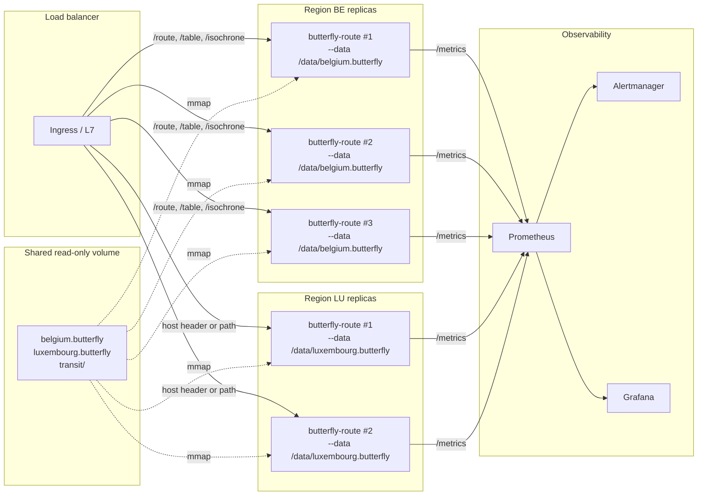

# Deployment guide

Production deployment of `butterfly-route` against a baked container or a step-tree directory. The runtime is a single Rust binary; everything ships in one Docker image. Multi-region serve is one process per region pack (see [Architecture](architecture.md)).

If you have never run the server, start with the [Quickstart](quickstart.md). For request shapes see the [API reference](api.md). For boot or query failures see [Troubleshooting](troubleshooting.md).

## Build the container

The Dockerfile is multi-stage. Stage 1 is `rust:1.95-trixie` and builds the release binary (Cargo workspace, `protobuf-compiler` is needed for the `gtfs-rt` codegen). Stage 2 is `debian:trixie-slim` with `curl` and `ca-certificates` only; the binary copies in and the image runs as a non-root `butterfly` user.

```dockerfile
FROM rust:1.95-trixie AS builder
# ... cargo build --release -p butterfly-route
FROM debian:trixie-slim
COPY --from=builder /build/target/release/butterfly-route /usr/local/bin/butterfly-route
USER butterfly
VOLUME /data
EXPOSE 8080 8081
ENV RUST_LOG=info,tower_http=debug
HEALTHCHECK --interval=30s --timeout=5s --start-period=25s --retries=3 \
    CMD curl -f http://localhost:8080/health || exit 1
ENTRYPOINT ["butterfly-route"]
CMD ["serve", "--data-dir", "/data", "--port", "8080", "--log-format", "json"]
```

Build it:

```bash
docker build -t butterfly-route .
```

The image is roughly 26 GB once a baked Belgium container is mounted at runtime; the image itself is small (the binary is ~80 MB) and the size lives in the data volume.

## Run conventions

The container reads everything from `/data`. Mount your baked region(s) there:

```bash
docker run -d --name butterfly \
  -p 3001:8080 \
  -p 3002:8081 \
  -v "${PWD}/data/belgium:/data" \
  --memory=32g \
  butterfly-route
```

- **`-p 3001:8080`** — REST/JSON (Axum). Default container port is 8080.
- **`-p 3002:8081`** — Arrow Flight gRPC (tonic). Default is 8081 (REST port + 1).
- **`-v ./data:/data`** — required. The container path is fixed by the Dockerfile `CMD`; if you override `--data-dir`, mount accordingly.

**Recommended resources:**

- **32 GB RAM.** Belgium steady-state RSS is ~24 GB with 4 modes (~5.13M EBG nodes per mode) plus the 754K-entry road-name index, the merged transit timetable, the ULTRA transfer graph, and the per-region `AvoidWeightCache` (default 8 entries × ~100-200 MB = up to 1.6 GB ceiling). Headroom matters: avoid-polygon and exclude recustomizations briefly allocate a second weight set. Below 28 GB you will OOM on first avoid query.
- **8+ vCPUs.** Matrix and isochrone parallelism saturate near 8 cores (memory-bandwidth limited beyond that). REST concurrency is capped at 32 in-flight requests and 4 for `/isochrone/bulk`; gRPC Flight is unbounded but bound by the same backends.
- **Fast local disk for first-load mmap.** All step artefacts are mmap'd; pages fault in during boot. On NVMe the difference between cold and warm boot is ~10 s.

**Boot time expectations:**

| Configuration | Time to first `/health` 200 |
|---|---|
| Belgium baked container, road-only (`--modes car`) | ~10 s |
| Belgium baked container, all 4 modes, no transit | ~30 s |
| Belgium baked container, all 4 modes + transit (4 feeds, ULTRA rebuild) | ~3 min |
| Belgium baked container + transit + `transfers.bin` cache hit | ~45 s |

The transit transfer graph (~66 k stops, ~668 k edges) is rebuilt at boot if the cache provenance hash mismatches the foot CCH or feed checksums. Bake the cache once and the rebuild only re-fires when feeds or the CCH change.

## Configuration

### Environment variables

| Variable | Default | Effect |
|---|---|---|
| `BUTTERFLY_AVOID_CACHE_CAP` | `8` | LRU capacity for the per-region recustomized-weight cache. Each entry holds time + distance weights + flat adjacencies, ~100-200 MB on Belgium. The default caps memory at ~1.6 GB per region. Drop to `2` or `4` on RAM-constrained hosts; raise on hosts serving heavy `avoid_polygons` traffic with a small working set of polygon shapes. |
| `BUTTERFLY_RSS_CHECKPOINTS` | unset | When set to `1`, the server emits `RSS_CHECKPOINT phase=... total_kb=N anon_kb=M file_kb=K` lines at every boot phase, parsed from `/proc/self/smaps_rollup`. Equivalent to passing `--rss-checkpoints`. Use for capacity-planning diagnostics. |
| `RUST_LOG` | `info,tower_http=debug` (in the Dockerfile) | Standard `tracing-subscriber` filter. To debug avoid/exclude customization passes: `RUST_LOG=info,butterfly_route::server::exclude=debug`. To trace HTTP request lifecycle: `RUST_LOG=info,tower_http=trace`. |

### CLI flags (passed through `docker run` after the image name, or via `CMD` override)

| Flag | Default | Notes |
|---|---|---|
| `--data-dir <path>` | none, mutually exclusive with `--data` | Directory with either a `step{1..8}/` tree (legacy) or one-or-more `*.butterfly` containers (multi-region). Multi-region is auto-detected from the presence of any `*.butterfly` file. |
| `--data <path>` | none, mutually exclusive with `--data-dir` | Single `*.butterfly` container. Loaded via mmap. |
| `--port <N>` | 8080 (or next free) | REST listener. |
| `--grpc-port <N>` | `--port + 1` | gRPC Flight listener. |
| `--transport rest\|grpc\|both` | `both` | Disable one transport entirely; useful when running REST and gRPC on separate replica pools. |
| `--modes car,bike,foot,...` | all discovered | Limits which per-mode bundles are loaded. Each mode skipped saves ~5-6 GB RSS on Belgium. |
| `--regions BE,LU,...` | all discovered | Multi-region container directory only. Ignored with `--data`. |
| `--log-format text\|json` | `text`; the Dockerfile `CMD` sets `json` | Structured-log toggle. JSON in production, text for local debugging. |
| `--rss-checkpoints` | off | Same as `BUTTERFLY_RSS_CHECKPOINTS=1`. |
| `--eager-verify` | off | #160 lazy-CRC opt-out: walk every section's CRC at boot. Adds ~10-30 s to first-byte. Mutually exclusive with `--warmup-on-boot`. |
| `--warmup-on-boot` | off | Background-verify every section after `/health` first reports ready. Same total coverage as `--eager-verify`, faster to first byte. |
| `--overlay <path>` | none | #91 Phase 2: cross-region overlay container for cross-region P2P. |

### Data layout

Two supported layouts under the mounted `/data` volume:

**Single baked container (preferred for production):**

```
/data/
└── belgium.butterfly        # one-file mmap, embedded section manifest
```

Run with `--data /data/belgium.butterfly`. Fastest boot, single-file deploy artefact, CRC-verified per section (lazy by default, see #160 flags above).

**Step tree (legacy, useful for development):**

```
/data/
├── step1/   nodes.sa, nodes.si, ways.raw, relations.raw, node_signals.bin
├── step2/   way_attrs.<mode>.bin, turn_rules.<mode>.bin
├── step3/   nbg.csr, nbg.geo, nbg.node_map
├── step4/   ebg.nodes, ebg.csr, ebg.turn_table
├── step5/   w.<mode>.u32, t.<mode>.u32, mask.<mode>.bitset, filtered.<mode>.ebg
├── step6/   order.<mode>.ebg
├── step7/   cch.<mode>.topo
└── step8/   cch.w.<mode>.u32, cch.d.<mode>.u32, cch.w.<mode>_<variant>.u32
```

Run with `--data-dir /data`.

**Multi-region:**

```
/data/
├── belgium.butterfly
├── luxembourg.butterfly
└── france.butterfly
```

Run with `--data-dir /data`. Auto-detected from the `*.butterfly` extension. Use `--regions BE,LU` to load a subset.

A `transit/` subdirectory (next to the step tree or container files) triggers transit bootstrap on the primary region. See the transit section in [CLAUDE.md](../CLAUDE.md).

**Runtime calibration inputs (optional, next to the container):**

```
/data/
├── belgium.butterfly
├── edge_speeds.parquet             # directed per-edge observed/freeflow ratios (#454)
├── edge_speeds.rush_hour.parquet   # optional peak variant → synthetic mode car_rush_hour
└── recustomize_cache.car-edge.v3.bin   # written by the server (customized-weight cache, #444)
```

- `edge_speeds.parquet` schema: `osm_node_from INT64, osm_node_to INT64,
  speed_ratio DOUBLE` — one row per DIRECTED edge keyed by endpoint OSM node
  ids, ratio in `[0.05, 1.0]`. At boot the server recustomizes `?mode=car`
  from it (a bad/absent table is non-fatal: it logs and serves the baked
  weights).
- Optional parquet KV metadata `time_scale` (sanity `[0.5, 2.0]`, absent →
  1.0): a global end-to-end factor applied to BOTH link weights and turn
  penalties before customization (#524). Producers set it to land a measured
  level anchor exactly in one step — multiplying it into the ratios instead
  only propagates ~55 % per pass (turn costs are not scaled by ratios) and
  erodes rank correlation.
- The cache file is keyed by the parquet bytes + base weights CRC, so
  refreshing the table (or its metadata) invalidates it automatically;
  the `.v3` tag bumps whenever the interpretation changes.

## Health and metrics

### `/health`

JSON, no auth, served by the same Axum router as the API. Shape:

```json
{
  "status": "ok",
  "version": "0.x.y",
  "uptime_s": 1234,
  "modes": ["bike", "car", "foot", "truck"],
  "data_dir": "/data",
  "nodes_count": 5132876,
  "edges_count": 12876543,
  "named_roads_count": 754321,
  "regions_count": 1,
  "regions": ["BE"],
  "total_nodes_count": 5132876,
  "total_edges_count": 12876543,
  "verify_status": "verified",
  "verify": {
    "n_sections": 87,
    "n_verified": 87,
    "n_unverified": 0,
    "n_verifying": 0,
    "n_failed": 0,
    "failed": []
  },
  "avoid_cache": [
    {"region": "BE", "hits": 142, "misses": 18, "hit_rate": 0.8875, "size": 8, "capacity": 8}
  ]
}
```

`verify_status` transitions through `ok` (no manifest, legacy step tree), `pending` (sections still verifying in the background), `verified` (all sections clean), `degraded` (one or more sections failed CRC — server keeps running but the failed sections will panic on access).

**Kubernetes probes:**

```yaml
livenessProbe:
  httpGet: { path: /health, port: 8080 }
  initialDelaySeconds: 30        # bump to 200 if transit is loaded
  periodSeconds: 30
  timeoutSeconds: 5
  failureThreshold: 3
readinessProbe:
  httpGet: { path: /health, port: 8080 }
  initialDelaySeconds: 30        # bump to 200 if transit is loaded
  periodSeconds: 10
  timeoutSeconds: 5
  failureThreshold: 2
```

The readiness probe should only mark ready once the listener is up; `--warmup-on-boot` lets you serve traffic while CRC verification runs in the background. Drive `verify_status=degraded` to an alert (see below) rather than failing readiness on it.

### `/metrics`

Prometheus exposition format, served by `axum_prometheus::PrometheusMetricLayer`. The router-level HTTP metrics (`axum_http_requests_*`) are provided by that crate. butterfly-route specifically adds:

| Metric | Type | Labels | Source |
|---|---|---|---|
| `butterfly_route_avoid_cache_hits` | gauge | `region` | `server::metrics::record_avoid_cache_stats` |
| `butterfly_route_avoid_cache_misses` | gauge | `region` | same |
| `butterfly_route_avoid_cache_size` | gauge | `region` | same |
| `butterfly_route_avoid_cache_capacity` | gauge | `region` | same |
| `butterfly_route_sections_verified_total` | counter | none | `record_section_verified` |
| `butterfly_route_sections_verify_pending` | gauge | none | `register_pending` / saturating decrement |
| `butterfly_route_section_verify_duration_seconds` | histogram | `section` | `record_section_verified` |
| `butterfly_route_section_verify_failed_total` | counter | `section` | `record_section_failed` |
| `butterfly_route_region_nodes_total` | gauge | `region` | `region_metrics::register_region_size` at boot |
| `butterfly_route_region_edges_total` | gauge | `region` | same |
| `butterfly_route_query_total` | counter | `region`, `endpoint` | `region_metrics` (per-request) |
| `butterfly_route_query_duration_seconds` | histogram | `region`, `endpoint` | same |
| `butterfly_route_query_cross_region_total` | counter | `src`, `dst` | cross-region P2P dispatch |

`avoid_cache_*` gauges are refreshed on every `/health` scrape (the handler mirrors the live atomic counters into the Prometheus registry). Scrape `/metrics` and `/health` together to keep them coherent.

### Prometheus scrape

```yaml
scrape_configs:
  - job_name: butterfly-route
    scrape_interval: 15s
    scrape_timeout: 5s
    metrics_path: /metrics
    static_configs:
      - targets:
          - butterfly-route-0.internal:3001
          - butterfly-route-1.internal:3001
```

15 s is the sweet spot: `axum_prometheus` histograms are cheap, and the avoid-cache snapshot only refreshes when `/health` is hit, so don't scrape faster than `/health` is polled by your load balancer or readiness probe.

### Alerting rules

```yaml
groups:
  - name: butterfly-route
    rules:
      - alert: ButterflyAvoidCacheThrashing
        # Hit rate < 20% sustained 10m with >100 queries.
        expr: |
          (
            sum by (region) (rate(butterfly_route_avoid_cache_hits[5m]))
            /
            clamp_min(sum by (region) (
              rate(butterfly_route_avoid_cache_hits[5m])
              + rate(butterfly_route_avoid_cache_misses[5m])
            ), 1)
          ) < 0.2
          and on (region) sum by (region) (
            rate(butterfly_route_avoid_cache_hits[5m])
            + rate(butterfly_route_avoid_cache_misses[5m])
          ) > 100 / 60
        for: 10m
        annotations:
          summary: "Avoid-cache thrashing on {{ $labels.region }} — bump BUTTERFLY_AVOID_CACHE_CAP."

      - alert: ButterflyRouteSlow
        expr: |
          histogram_quantile(0.99,
            sum by (le, endpoint) (
              rate(butterfly_route_query_duration_seconds_bucket{endpoint="/route"}[5m])
            )
          ) > 0.5
        for: 5m
        annotations:
          summary: "/route p99 > 500 ms."

      - alert: ButterflyVerifyDegraded
        # Probe-driven: scrape /health, expose verify_status via blackbox or a sidecar.
        # Direct signal: any section_verify_failed_total increases.
        expr: increase(butterfly_route_section_verify_failed_total[15m]) > 0
        for: 0m
        annotations:
          summary: "Section CRC verification failed — container is corrupt or truncated."
```

## Graceful shutdown

The server installs SIGINT and SIGTERM handlers (see `server::shutdown_signal`). On signal:

1. Both REST (Axum `with_graceful_shutdown`) and gRPC (tonic `serve_with_shutdown`) stop accepting new connections.
2. In-flight requests run to completion, bounded by the per-route timeout (120 s for normal endpoints, 600 s for `/isochrone/bulk`).
3. `tracing::info!("server shut down gracefully")` is emitted and the process exits 0.

There is no explicit drain timeout in code beyond the route timeouts. For Kubernetes:

```yaml
terminationGracePeriodSeconds: 660   # 600s stream timeout + 60s slack
```

If you don't run `/isochrone/bulk`, drop to 180 s. Docker's default `docker stop --time` is 10 s — set it explicitly: `docker stop --time 180 butterfly`.

## Deployment topology



The load balancer routes by region (host header, path prefix, or client logic). The data volume is read-only and shared between replicas of the same region; each replica mmaps the same file independently.

## Scaling notes

- **One process per region pack.** A single binary can load multiple regions in one process (`--data-dir` over a directory of `*.butterfly` files), and that is the current scale-out shape for cross-region serve. Going further than #91 multi-region containers — sharding a region across processes for horizontal scale-out — is not yet implemented. If you need it, read `route/src/server/regions.rs` and `route/src/server/cross_region.rs` first.
- **Cache locality is per-process.** Every replica has its own `AvoidWeightCache`. Multi-replica deployments amortize recustomization cost independently per replica — a polygon that hits the cache on replica A still costs the #240 incremental-BFS MISS (~0.8–1.2 s on Belgium, polygon-size dependent) on replica B the first time. For predictable latency, pin clients (consistent hash on polygon hash) or accept the cold-cache outliers.
- **gRPC Flight is single-region in #91 Phase 1.** With multiple regions loaded, the Flight server only serves the primary region (the lexicographically first one or whichever was discovered first). REST handles all regions. Cross-region Flight is tracked for a future PR.
- **Memory scales with modes, not query volume.** Doubling QPS does not double RSS; adding a mode does (~5-6 GB per mode on Belgium). Trim with `--modes`.
- **HTTP concurrency is bounded.** 32 in-flight `/route`/`/table`/etc., 4 in-flight `/isochrone/bulk`. Past those limits clients see a queue, not a 503; size your timeouts accordingly.
