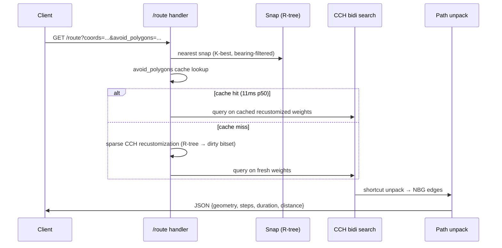

# butterfly-route

Production-grade routing engine for OSM data. Exact turn-aware edge-based CCH (Customizable Contraction Hierarchies) for car / bike / foot / truck, with a multimodal transit engine (RAPTOR + ULTRA transfers) bolted onto the same process. Ships REST + Arrow Flight gRPC. Deployed on Belgium; see the [workspace README](../README.md) for the rest of the ecosystem.

## What it does

- **Exact turn-aware P2P routing** — bidirectional CCH on the edge-based graph; turn restrictions and penalties are enforced, not approximated.
- **Distance matrices** — `POST /table` (Bucket M2M, sparse) and Flight `matrix` (K-lane batched PHAST, streams 50k×50k+).
- **Isochrones** — time / distance thresholds, depart or arrive direction, multi-contour, bulk endpoint, GeoJSON or WKB.
- **Routing controls** — `avoid_polygons` (R-tree + sparse CCH recustomization), `exclude=toll,ferry,motorway`, bearing hints, traffic profiles (`?traffic=rush_hour`).
- **Map matching** — HMM + Viterbi (Newson & Krumm) over GPS traces.
- **TSP / trip optimization** — nearest-neighbour + 2-opt + or-opt.
- **Multimodal transit** — RAPTOR over merged GTFS + NeTEx-EPIP feeds, ULTRA-preprocessed foot transfer graph, access/egress legs via the road CCH.
- **Auxiliary** — `/nearest` snap, `/height` SRTM lookup, catchment hulls, multi-region cross-border overlay, Prometheus `/metrics`.

## Build

```bash
cargo build --release -p butterfly-route
```

Produces two binaries: `butterfly-route` (pipeline + server) and `butterfly-bench` (benchmark harness).

## Pipeline (build-time)


Each step writes a `stepN.lock.json` with SHA-256 checksums for reproducibility. NBG is a build-time intermediate; the EBG is the single source of truth for routing.

Example invocation (car mode, Belgium):

```bash
butterfly-route step1-ingest    --input belgium.pbf --outdir data/step1
butterfly-route step2-profile   --ways data/step1/ways.raw --relations data/step1/relations.raw --models-dir models --outdir data/step2
butterfly-route step3-nbg       --nodes data/step1/nodes.sa --ways data/step1/ways.raw --way-attrs car=data/step2/way_attrs.car.bin --outdir data/step3
butterfly-route step4-ebg       --nbg-csr data/step3/nbg.csr --nbg-geo data/step3/nbg.geo --nbg-node-map data/step3/nbg.node_map --way-attrs car=data/step2/way_attrs.car.bin --turn-rules car=data/step2/turn_rules.car.bin --outdir data/step4
butterfly-route step5-weights   --ebg-nodes data/step4/ebg.nodes --ebg-csr data/step4/ebg.csr --turn-table data/step4/ebg.turn_table --nbg-geo data/step3/nbg.geo --way-attrs car=data/step2/way_attrs.car.bin --outdir data/step5
butterfly-route step6-order     --filtered-ebg data/step5/filtered.car.ebg --ebg-nodes data/step4/ebg.nodes --nbg-geo data/step3/nbg.geo --mode car --outdir data/step6
butterfly-route step7-contract  --filtered-ebg data/step5/filtered.car.ebg --order data/step6/order.car.ebg --weights data/step5/w.car.u32 --turns data/step5/t.car.u32 --mode car --outdir data/step7
butterfly-route step8-customize --cch-topo data/step7/cch.car.topo --filtered-ebg data/step5/filtered.car.ebg --order data/step6/order.car.ebg --weights data/step5/w.car.u32 --turns data/step5/t.car.u32 --ebg-nodes data/step4/ebg.nodes --mode car --outdir data/step8
butterfly-route pack            --data-dir data --out belgium.butterfly --region BE
```

Repeat steps 3-8 with `--way-attrs bike=...`, `--turn-rules bike=...` etc. to add modes. Modes are discovered from the filenames in each step directory; there are no hardcoded mode names in the Rust code. Traffic recustomization (`step8-customize --traffic rush_hour.traffic.json`) emits an extra `cch.w.<mode>_<variant>.u32` and is auto-discovered by `serve` as a synthetic mode (e.g. `car_rush_hour`).

See [Architecture](../docs/architecture.md) for the full edge-based CCH derivation.

## Serve (query-time)

```bash
butterfly-route serve --data belgium.butterfly --port 3001
# or, for an unpacked tree:
butterfly-route serve --data-dir ./data/belgium --port 3001
```

Boot mmaps the container, builds the spatial index, loads transit feeds if present, and exposes REST on `--port` and Arrow Flight gRPC on `--grpc-port` (defaults to `port + 1`).



The `avoid_polygons` fast path is keyed on a hash of the polygon set; cold-path recustomization uses sparse triangle relaxation (~16 s on Belgium) and is cached for subsequent requests. Full endpoint catalogue in [API reference](../docs/api.md).

## Configuration

| Flag / env | Purpose |
|---|---|
| `--data <file.butterfly>` | Single-container mmap load (preferred). |
| `--data-dir <dir>` | Unpacked `step1/`…`step8/` tree (dev). |
| `--port`, `--grpc-port` | REST and Flight listener ports. |
| `--transport rest\|grpc\|both` | Restrict to one transport. |
| `--modes car,bike` | Load a subset of discovered modes. |
| `--regions BE,LU` | Load a subset of regions from `--data-dir`. |
| `--overlay <file>` | Cross-region overlay container for inter-region P2P. |
| `--log-format text\|json` | Structured logging. |
| `--rss-checkpoints` | Emit `RSS_CHECKPOINT` lines at each boot phase. |
| `--eager-verify` / `--warmup-on-boot` | CRC verification policy (default: lazy on first access). |
| `RUST_LOG` | Standard `tracing-subscriber` env filter. |

Full Docker recipe and ops guide in [Deployment](../docs/deployment.md). Quick first-run path in the [Quickstart](../docs/quickstart.md).

## Performance

Belgium, 8 threads, release build. See `bench/route/results/` for raw runs.

| Query | Number |
|---|---|
| Matrix 10k×10k (Bucket M2M, source-tiled) | 18.3 s — **1.8× faster than OSRM CH** |
| Matrix 1000×1000 | 268 ms — 2.56× faster than OSRM |
| Isochrone 30-min car (block-gated PHAST) | 5 ms p50 |
| Route P2P with `avoid_polygons` cache hit | 11 ms |
| Multimodal `/transit` warm | 35 ms p50 |
| Transit bulk, varied origins | 311 q/s sustained |

The 10k×10k win came from L3-aware source tiling (`matrix/tile_geometry.rs`); the isochrone win came from block-gated downward scan (C1). Full benchmark methodology and OSRM/Valhalla baselines in [Architecture](../docs/architecture.md) and the workspace `CLAUDE.md`.

## Workspace dependencies

- [`butterfly-common`](../butterfly-common) — shared error types.
- [`butterfly-dl`](../dl) — used for region pack downloads and GTFS feed fetch (`transit-fetch`).

## License

AGPL-3.0-or-later (matches the workspace).
